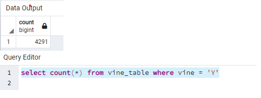
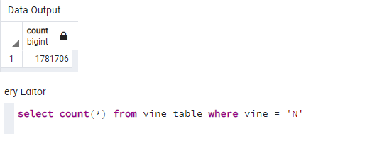
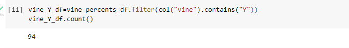
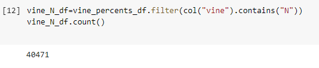
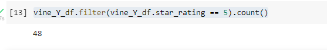
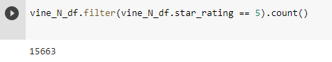

# Amazon_Vine_Analysis
### 16 AWS, RDS and posgres/pgadmin

## Overview of the analysis:
Amazon has two types of reviews; 

First are those which are 'non-vine' reviews, where people simply take the time to write reviews independantly with
no paid incentive. 
 
Second are written by members of the paid Amazon Vine program. The Amazon Vine program is a 
service that allows manufacturers and publishers to receive reviews for their products. Companies (like SellBy whom we have
been working for during this module) pay a small fee to Amazon and provide products to Amazon Vine members, 
who are then required to publish a review.

We are tasked with identifying if the vine reviews are in anyway biased.

## Results of our Video Game analysis of the reviews: 

- How many total Vine reviews were there for the Video Game listing?

- How many total non-Vine reviews were there for the Video Game listing?

- How many Vine reviews were 5 stars that had had percent of helpful votes/total votes > .50? 

- How many non-Vine reviews were 5 stars that had had percent of helpful votes/total votes > .50? 

- What percentage of Vine reviews were 5 stars? 
If you take the above count of 94 and then the 48 that were 5 stars as shown below, that gives a total of 51%:

- What percentage of non-Vine reviews were 5 stars?
if you take the count of 40,471 and then the 15663 shown below that were 5 stars, that gives a total of 39%:

## Summary: In your summary, state if there is any positivity bias for reviews in the Vine program. 
The data shows that the vine reviews tend to have a 
Use the results of your analysis to support your statement. 

## Additional Analysis that is recommded to better understand the reviews:

Then, provide one additional analysis that you could do with the dataset to support your statement.

## NYC Citi Bike Overview
My client and friend Kate is interested in opening up bike rental kiosks in Des Moines, Iowa.
Citi Bike rental data has been released to the public and Kate and I are able to use the data for our analysis using the Tableau application. 
We will need to be make sure we apply the data from NYC appropriately to Des Moines given the many differences including size of city, culteral and tourism rates.
We started with the following dashboard:

####################################
### bikesharing -> Module 14
# New York City Citi Bike Analysis
Link to Story:
[https://public.tableau.com/app/profile/rose.baumann/viz/CitiBikesharingNYC/NewYorkCityBikeRentalAnalysis?publish=yes] 

## NYC Citi Bike Overview
My client and friend Kate is interested in opening up bike rental kiosks in Des Moines, Iowa.
Citi Bike rental data has been released to the public and Kate and I are able to use the data for our analysis using the Tableau application. 
We will need to be make sure we apply the data from NYC appropriately to Des Moines given the many differences including size of city, culteral and tourism rates.
We started with the following dashboard:

###Tableau was used to create 7 graphs that represent some of the data:
 1. Checkout Times for Users
 2. Checkout Times by Gender
 3. Trips by Day and Hour
 4. Trips by Gender by Day and Hour
 5. User Trips by Gender and Day
 6. Starting Location by Gender
 7. Starting Location by User (Customer or Subscriber)
See below results

### NYC Bike Analysis Results
The analysis of the Citi data shows the following and can help us apply the same to our porosed Des Moines location:

### Data to be applied to new proposed location in Des Moines:

- Looking at all of the length of trips, even upon filtering variious amounts of time, most are under an hour. 
It may be worthwhile to investigate the price of rentals and if the rate could be decreased for additional hours of rental to understand this trend.

- To understand more about our riders we can look at the gender of our riders which only echos that of all riders.  There is not much difference between 
men and women accept that we can see men are definitely outnumber women as customers.

- In looking at the days of the week we can see that ridership increses during peak rush hours. 
On the weekend, as would be expected, riders use the bikes during the entire day.

- And the gender breakdown only echos this pattern. It is interesting that there seems to be a lull on Wednesday evenings.

